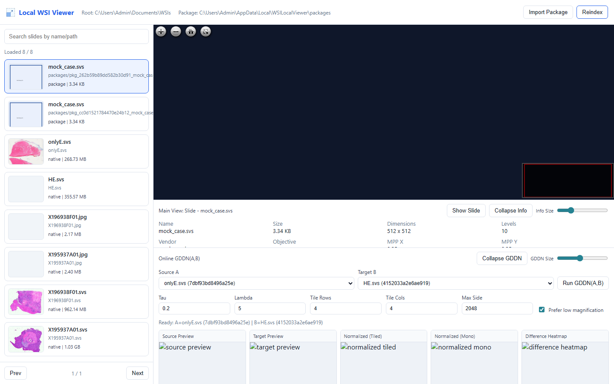
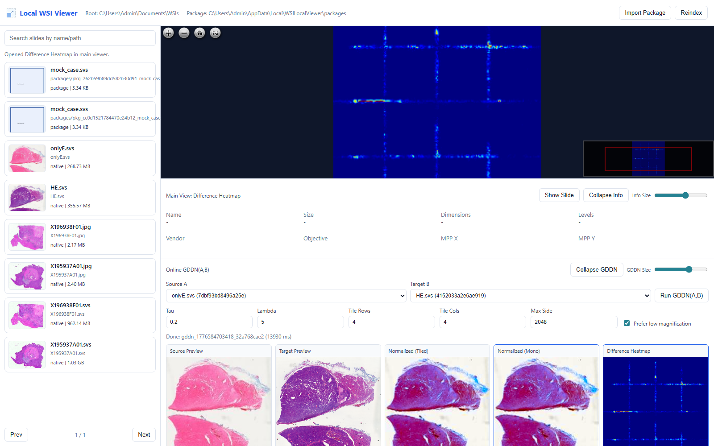

# 附录A 本地-远端病理图像传输与在线评阅应用说明

## A.1 研发目标与应用场景

本附录对应的应用系统面向“医院A采集端上传、医院B评阅端在线解码与阅片”的远程协作场景，目标是在普通计算资源条件下，实现超大尺寸病理全视野图像（Whole Slide Image, WSI）的高效传输、在线查看与颜色标准化辅助分析。  
系统重点解决三类问题：  
1. WSI 原始文件体积大、跨机构传输效率低；  
2. 不同扫描设备导致的染色分布差异影响比对评阅；  
3. 评阅端对交互响应速度和可视化一致性要求高。

## A.2 系统架构与技术路线

系统采用“数据打包传输 + 本地在线解码查看 + 在线颜色标准化”的技术路线，兼顾工程可用性与算法可扩展性。  
其总体流程如下：


## A.3 核心功能说明

### A.3.1 本地/远端数据兼容查看

系统支持 `.svs`、`.tif/.tiff`、`.jpg/.png` 等病理图像格式，通过 OpenSlide 优先读取多分辨率金字塔结构；当图像尺寸超大时，优先选用低倍率层进行快速预览，减少首屏等待时间。

### A.3.2 在线颜色标准化（GDDN(A,B)）

用户在界面中选择源图像 A 与目标图像 B，可在线执行 GDDN 标准化，得到：
- Source Preview
- Target Preview
- Normalized (Tiled)
- Normalized (Mono)
- Difference Heatmap

系统提供参数化控制：`tau`、`lambda`、`tileRows`、`tileCols`、`maxSide` 以及“Prefer low magnification”选项，以平衡质量与时延。

### A.3.3 交互式评阅增强

为提升评阅效率，系统实现：
- 结果卡片点击切换：下方结果图可一键切换到主视图并进行缩放/平移；
- 信息区可折叠与高度调节；
- Online GDDN 区域可折叠与高度调节；
- 一键返回原始切片主视图（Show Slide）。

## A.4 算法实现要点（工程化视角）

GDDN 模块在工程实现中采用“全局统计 + 分块处理”策略：  
1. 在 LAB 颜色空间估计目标域统计量；  
2. 对源图像预先计算全局颜色与梯度统计，降低分块边界伪影；  
3. 结合结构权重与 Screened Poisson 求解完成颜色与结构联合约束；  
4. 同步输出分块结果、整图结果与差分热图用于质量诊断。

当输入为超大 WSI 时，算法默认可在低倍率层进行近实时预处理，可作为临床快速预览通道；高倍率精细标准化可在后处理阶段离线执行。

## A.5 典型使用流程（评阅端）

1. 启动本地服务并指定切片根目录；  
2. 在左侧列表检索并打开目标切片；  
3. 在 Online GDDN(A,B) 中选择 A/B 图像并设置参数；  
4. 执行标准化并观察五类结果图；  
5. 点击结果卡片放大到主视图进行细节核查；  
6. 根据需要折叠/调整信息区与 GDDN 区域，优化阅片工作空间。

## A.6 关键界面图

**图A-1 本地WSI查看主界面（切片列表 + 主视图 + 基础信息）**  


**图A-2 在线GDDN(A,B)交互界面（参数设置 + 结果对比 + 主视图切换）**  


## A.7 测试与复现说明

在 Windows 本地环境下可使用以下脚本进行回归测试：

```powershell
powershell -ExecutionPolicy Bypass -File .\scripts\test-local-ui.ps1 -SlideRoot "C:\Users\Admin\Documents\WSIs" -Port 8031
powershell -ExecutionPolicy Bypass -File .\scripts\test-color-normalization-ui.ps1 -SlideRoot "C:\Users\Admin\Documents\WSIs" -Port 8032
```

测试通过后可获得界面截图与状态输出，用于论文附录的可复现性佐证。

## A.8 小结

该应用实现了病理WSI在跨机构场景中的“高效传输-在线解码-标准化评阅”闭环，并通过可调式交互界面兼顾算法可解释性与阅片可用性。作为论文工程成果，其价值在于将颜色标准化算法与临床可操作的软件流程进行一体化落地，为后续多中心病理协同研究提供了可复用的技术基线。
